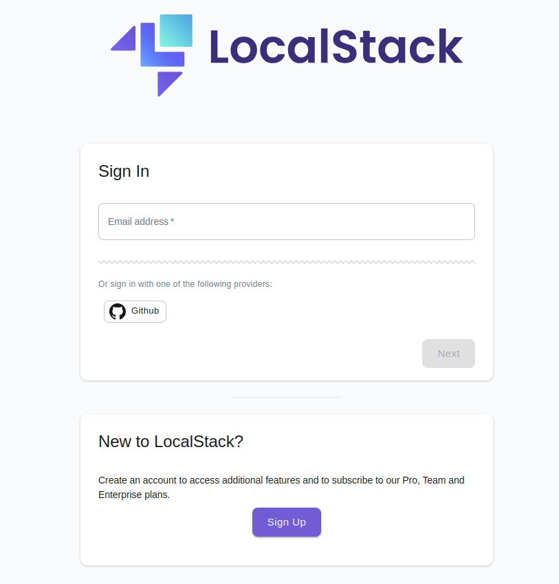
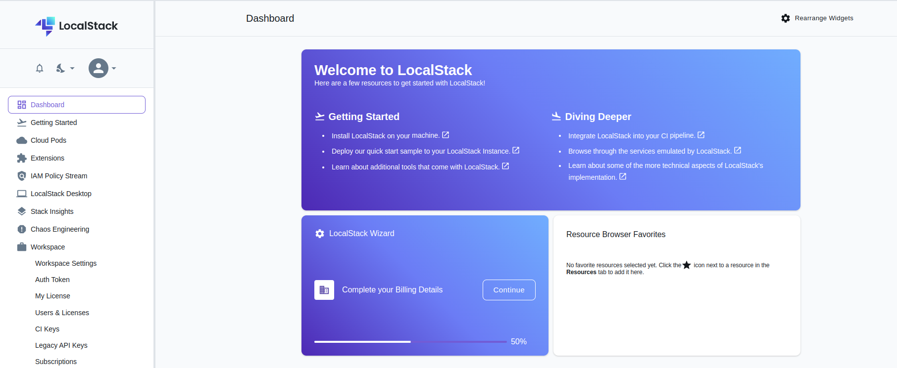
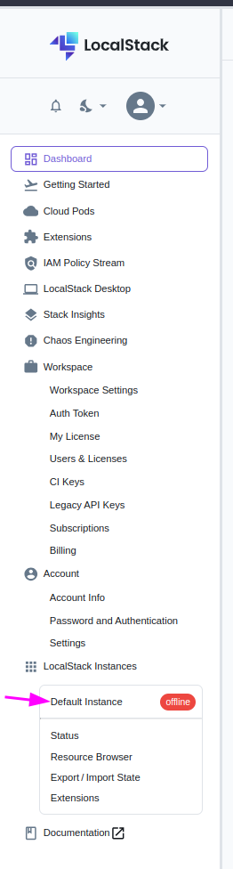
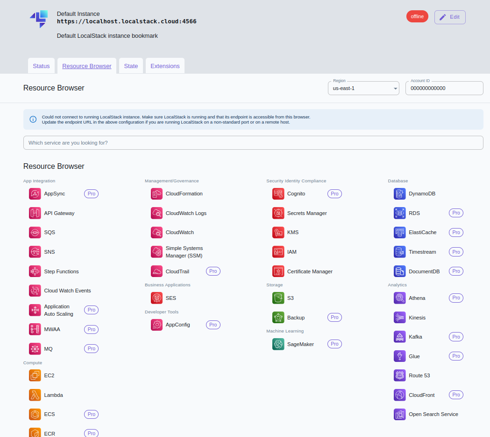
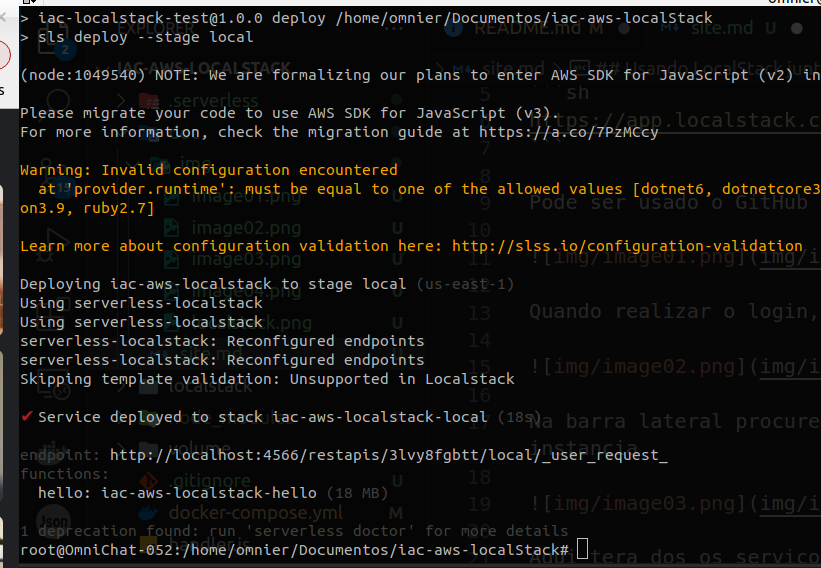
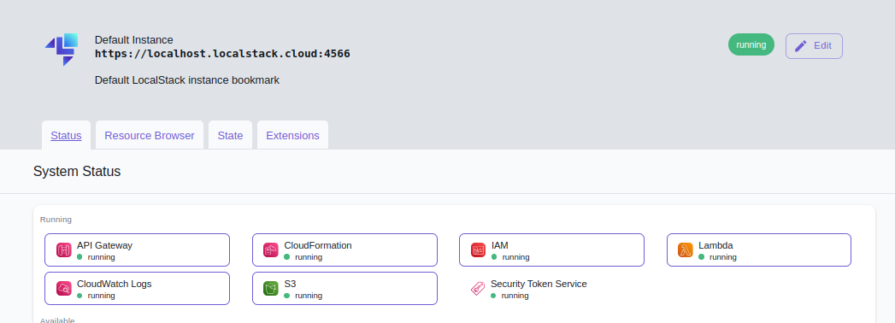
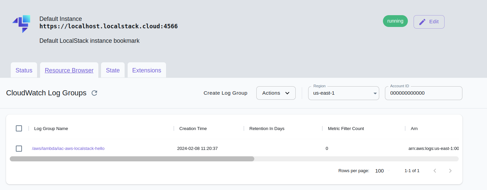
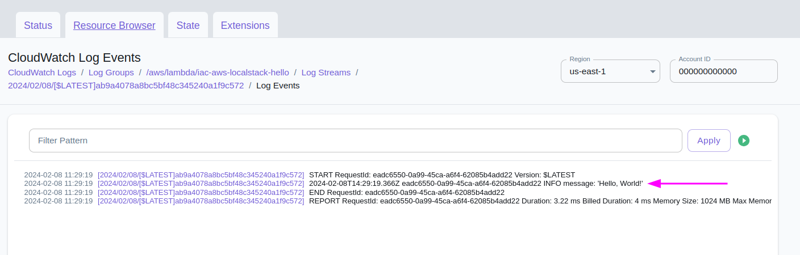

## Usando LocalStack junto com Serverless Framework: Resource Browser

Conseguimos acessar a infra criada através  Browser pelo site da localstack

```sh
https://app.localstack.cloud/
```

Pode ser usado o GitHub para se autenticar



Quando realizar o login, ira cair nessa pagina:



Na barra lateral procure pelo menu Defaul instancia
<p align="center">
  
</p>

Aqui tera dos os serviços disponivel quando e criado usando serverless.



Quando realizamos o deploy local ficara disponivel como Ranning os recurso que o seu serviços esta usando.

Deploy:


Serviços Ranning:


Quando realizamos uma requisição na HTTP/REST  conseguimos também consultar os logs da lambda que foi executado.

Exemplo de requisição POST:
```sh
curl --location --request POST 'http://3lvy8fgbtt.execute-api.localhost.localstack.cloud:4566/local/hello' --header 'Content-Type: application/json' --data-raw ''

Retorno Mensagem:

{"message":"Hello, World!"}
```

Acessando o serviço do CloudWatch Log, Teremos um log Group do projeto.



Retorne em log da requisição em enviado:

