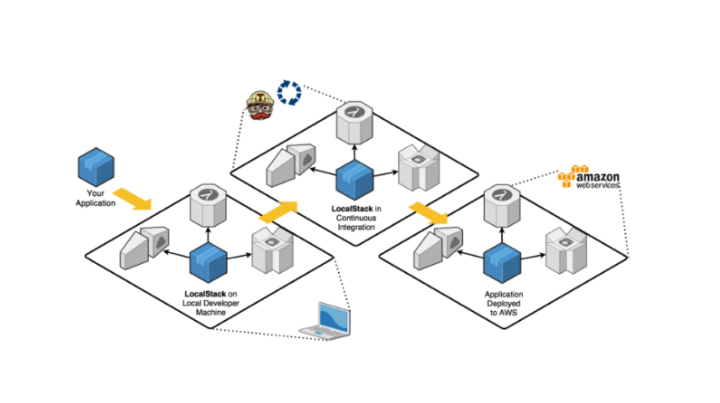

## Usando LocalStack junto com Serverless Framework: Um guia passo a passo



## Installation

[link documentação site oficial](https://docs.localstack.cloud/getting-started/installation/)

Você pode baixar o respectivo binário para sua arquitetura diretamente:

For x86-64:
```sh
curl -Lo localstack-cli-3.1.0-linux-amd64-onefile.tar.gz \
    https://github.com/localstack/localstack-cli/releases/download/v3.1.0/localstack-cli-3.1.0-linux-amd64-onefile.tar.gz
```


Em seguida, extraia a CLI LocalStack do terminal:

```sh
sudo tar xvzf localstack-cli-3.1.0-linux-*-onefile.tar.gz -C /usr/local/bin
```


Para verificar se o LocalStack CLI foi instalado corretamente, você pode verificar a versão em seu terminal:

```sh
localstack --version
```

## instalation AWS Command Line Interface (CLI) - use localstack

[link documentação site oficial](https://docs.localstack.cloud/user-guide/integrations/aws-cli/#localstack-aws-cli-awslocal)


```sh
pip install awscli-local
```

### Pré-requisitos
 - Instale o Node.js (recomendamos a versão 14.x ou superior).
- Instale o Docker e o Docker Compose.
- Instale o Serverless Framework globalmente com o comando npm install -g serverless.

### Configurar o projeto
- Crie uma nova pasta para o projeto e navegue até ela no terminal.
- Execute npm init -y para criar um arquivo package.json.
- Instale as dependências necessárias com o comando  npm install --save-dev serverless serverless-localstack.

### Configurando o Serverless e LocalStack
- Crie um arquivo serverless.yml e adicione a seguinte configuração (substitua "meu-projeto" pelo nome do seu projeto):

```sh
service: iac-aws-localstack

provider:
  name: aws
  runtime: nodejs18.x
  stage: ${opt:stage, 'local'}
  region: us-east-1

plugins:
  - serverless-localstack

custom:
  localstack:
    stages:
      - local
    host: http://localhost
    edgePort: 4566

functions:
  hello:
    name: iac-aws-localstack-hello
    handler: handler.hello
    events:
      - http:
          path: hello
          method: post
```

## Starting LocalStack docker-composer

Você pode iniciar o LocalStack com Docker Compose configurando um arquivo docker-compose.yml. Atualmente, a versão 1.9.0+ do docker-compose é suportada.

```sh
version: "3.8"
services:
  localstack:
    container_name: iac-aws-localstack
    image: localstack/localstack
    ports:
      - '127.0.0.1:4566:4566'
      - '127.0.0.1:4571:4571'
    environment:
      # LocalStack configuration: https://docs.localstack.cloud/references/configuration/
      - LOCALSTACK_AUTH_TOKEN="ls-FosIJIBO-luBa-WUpe-9377-8829bUlo181f"
      - DEBUG=0 #Valor 1 habilitar DEBUG
      - SERVICES=logs,cloudformation,iam,s3,lambda,apigateway #Adicionar os serviços que estara usando
      - DATA_DIR=/tmp/localstack/data
      - LAMBDA_EXECUTOR=docker
      - LAMBDA_REMOTE_DOCKER=false
      - DOCKER_HOST=unix:///var/run/docker.sock
      - AWS_ACCESS_KEY_ID=test
      - AWS_SECRET_ACCESS_KEY=test
    volumes:
      - "${LOCALSTACK_VOLUME_DIR:-./volume}:/var/lib/localstack"
      - "/var/run/docker.sock:/var/run/docker.sock"
```


### Crie um arquivo handler.js com o seguinte código:

```sh
module.exports.hello = async (event) => {
  console.log("message: 'Hello, World!'")
  return {
    statusCode: 200,
    body: JSON.stringify({ message: 'Hello, World!' }),
  };
};
 
```


### Atualize os seguintes scripts no seu package.json

``` sh
  "scripts": {
    "infra:up": "docker-compose up -d",
    "infra:down": "docker-compose down",
    "infra:logs": "docker-compose logs -f",
    "deploy": "sls deploy --stage local"
  },
  ```
Agora que você configurou tudo, siga os passos abaixo para implantar e testar sua aplicação localmente:

## Inicie o LocalStack
No terminal, execute o seguinte comando para subir o LocalStack usando o Docker Compose:


```sh
npm run infra:up 
```

### Implante sua aplicação:

Com o LocalStack em execução, execute o seguinte comando no terminal para implantar sua aplicação usando o Serverless Framework:
```sh
npm run deploy 
```

No final sera retornado a seguinte saida:

```sh
✔ Service deployed to stack iac-localstack-test-local (19s)

endpoint: http://localhost:4566/restapis/u8ehgbwatt/local/_user_request_
functions:
  hello: iac-localstack-test-hello 
```
No final do endpoint coloque o /hello e tera um retorno da API

```sh
curl --location --request POST 'http://localhost:4566/restapis/u8ehgbwatt/local/_user_request_/hello' \
--header 'Content-Type: application/json' \
--data-raw ''
```

### Verifique mensagem de logs:

```sh
npm run infra:logs 
```

## Encerrar o ambiente:
Quando terminar de testar sua aplicação, execute o seguinte comando para encerrar o LocalStack e remover os contêineres Docker:

```sh
npm run infra:down 
```

# Starting LocalStack in Docker mod
- Precisa ter instalado do docker local

Este comando ira iniciar o localstack em background

```sh
localstack start -d
```
Em outro terminal abra e execute um deploy
```sh
sls deploy --stage local
```

No final sera retornado a seguinte saida:

```sh
✔ Service deployed to stack iac-localstack-test-local (19s)

endpoint: http://localhost:4566/restapis/u8ehgbwatt/local/_user_request_
functions:
  hello: iac-localstack-test-hello 
```
No final do endpoint coloque o /hello e tera um retorno da API

```sh
curl --location --request POST 'http://localhost:4566/restapis/u8ehgbwatt/local/_user_request_/hello' \
--header 'Content-Type: application/json' \
--data-raw ''
```

### Para consultar o status do serviço localStack

O método mais simples para verificar se LocalStack está ativo é consultar o endpoint de integridade para obter uma lista de serviços em execução:

```sh
curl http://localhost:4566/_localstack/health | jq
```


A seguinte saída seria recuperada:

```sh
{
  "services": {
    "acm": "disabled",
    "apigateway": "running",
    "cloudformation": "running",
    "cloudwatch": "disabled",
    "config": "disabled",
    "dynamodb": "disabled",
    "dynamodbstreams": "disabled",
    "ec2": "disabled",
    "es": "disabled",
    "events": "disabled",
    "firehose": "disabled",
    "iam": "running",
    "kinesis": "disabled",
    "kms": "disabled",
    "lambda": "running",
    "logs": "running",
    "opensearch": "disabled",
    "redshift": "disabled",
    "resource-groups": "disabled",
    "resourcegroupstaggingapi": "disabled",
    "route53": "disabled",
    "route53resolver": "disabled",
    "s3": "running",
    "s3control": "disabled",
    "scheduler": "disabled",
    "secretsmanager": "disabled",
    "ses": "disabled",
    "sns": "disabled",
    "sqs": "available",
    "ssm": "disabled",
    "stepfunctions": "disabled",
    "sts": "running",
    "support": "disabled",
    "swf": "disabled",
    "transcribe": "disabled"
  },
  "edition": "community",
  "version": "3.1.1.dev"
}

```

## Comando para verificar serviço disponivel que estão ativo basta usar local

```sh
localstack status services
```

##


```sh
┏━━━━━━━━━━━━━━━━━━━━━━━━━━┳━━━━━━━━━━━━━┓
┃ Service                  ┃ Status      ┃
┡━━━━━━━━━━━━━━━━━━━━━━━━━━╇━━━━━━━━━━━━━┩
│ acm                      │ disabled    │
│ apigateway               │ ✔ running   │
│ cloudformation           │ ✔ running   │
│ cloudwatch               │ disabled    │
│ config                   │ disabled    │
│ dynamodb                 │ disabled    │
│ dynamodbstreams          │ disabled    │
│ ec2                      │ disabled    │
│ es                       │ disabled    │
│ events                   │ disabled    │
│ firehose                 │ disabled    │
│ iam                      │ ✔ running   │
│ kinesis                  │ disabled    │
│ kms                      │ disabled    │
│ lambda                   │ ✔ running   │
│ logs                     │ ✔ running   │
│ opensearch               │ disabled    │
│ redshift                 │ disabled    │
│ resource-groups          │ disabled    │
│ resourcegroupstaggingapi │ disabled    │
│ route53                  │ disabled    │
│ route53resolver          │ disabled    │
│ s3                       │ ✔ running   │
│ s3control                │ disabled    │
│ scheduler                │ disabled    │
│ secretsmanager           │ disabled    │
│ ses                      │ disabled    │
│ sns                      │ disabled    │
│ sqs                      │ ✔ available │
│ ssm                      │ disabled    │
│ stepfunctions            │ disabled    │
│ sts                      │ ✔ running   │
│ support                  │ disabled    │
│ swf                      │ disabled    │
│ transcribe               │ disabled    │
└──────────────────────────┴─────────────┘
```

## Como usar o JavaScript AWS SDK com LocalStack.

[link documentação site oficial](https://docs.localstack.cloud/user-guide/integrations/sdks/javascript/)


## Troubleshooting

Agora você pode aproveitar a saída de log e relatórios de erros usando logs LocalStack. Para acessar os logs, execute o seguinte comando:

```sh
localstack logs
```

## Encerrar o ambiente Docker mod:

```sh
localstack stop
```